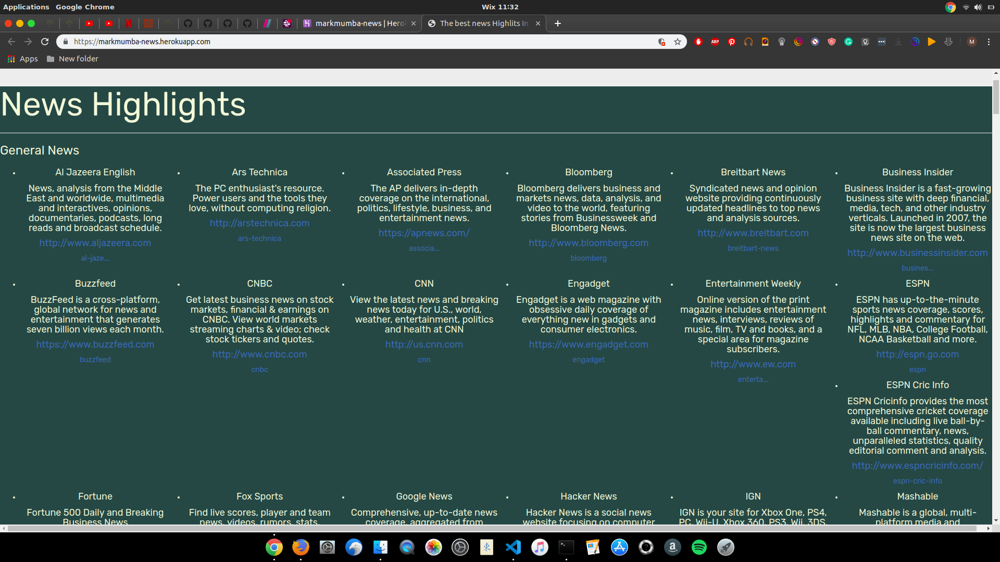

 # News Highlights

## By  Mark ian Mumba

## screenshot
;

## Description
 News Highlits is a web app that dislaces diffrent genre of news to the user such as sports,Technology and science.
 It also gives diffrent channels such as BBC

 ## Behaviour Driven Development
| Behaviour | Input | Output |
| :---------------- | :---------------: | ------------------: |
| Display news sources | **On page load** | List of various news sources is displayed per category |
| Display articles from a news source | **Click a news source** | Redirected to a page with a list of articles from the source |
| Display the preview of an article | **On page load** | Each article displays an image, title, description and publication date |
| Read an entire article | **Click an article** | Redirected to the news source's site to read the entire article |

 ## Setup And Installation
 ### prequisities
 * python3.6
 * pip
 * virtual environment

 ## Getting the App
  * One has to clone it to get on the local storage

  * in the terminal:

        $ git clone https://github.com/markmumba/News-Highlight.git
        $ cd News-Highlight

 ## Running the Application
* Creating the virtual environment

        $ python3.6 -m venv --without-pip virtual
        $ source virtual/bin/env
        $ curl https://bootstrap.pypa.io/get-pip.py | python            

* To run the application, in your terminal:

        $ chmod +x start.sh
        $ ./start.sh
        
## Technologies Used
* Python3.6
* Flask

## License
MIT &copy;2019  [Markian Mumba](https://github.com/markmumba/)